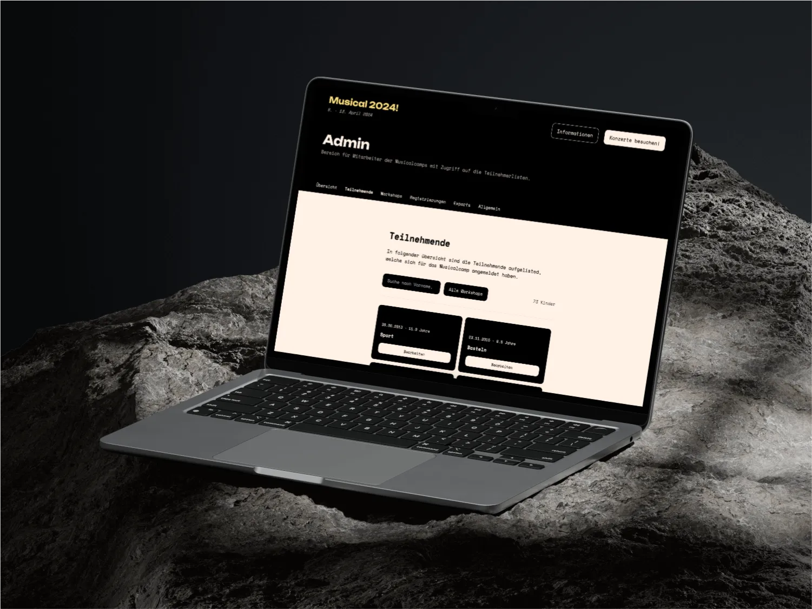
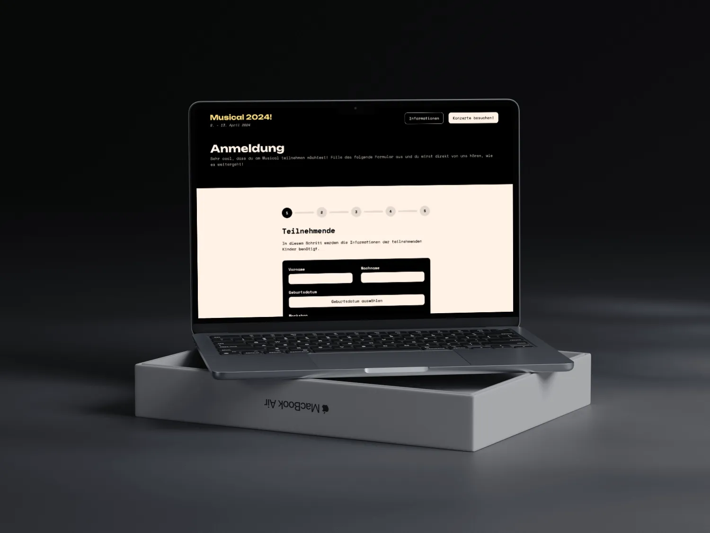

This project includes several components. It has an event-specific landing page, a simple signup process, and an administrative view for managing registered users.

There's also a personalized page for each user to access event resources, and an image portal that showcases fresh event images daily.

### Data Storage

To ensure reliable and efficient data management, the project utilizes Supabase as the persistence layer.

This provides a robust framework for storing and retrieving data, ensuring the smooth operation of the signup process and user management.

### Technology Employed

In terms of the technology used, the project employs React and Next.js to deliver a fast and efficient front-end user experience.

These powerful frameworks allow for the creation of dynamic, interactive web pages, ensuring a high-quality user experience.
